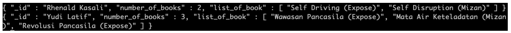
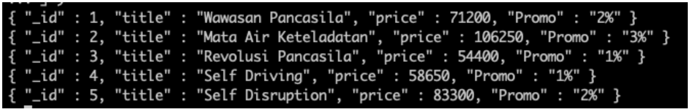
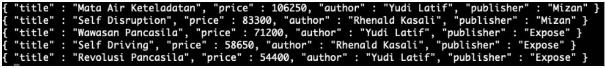
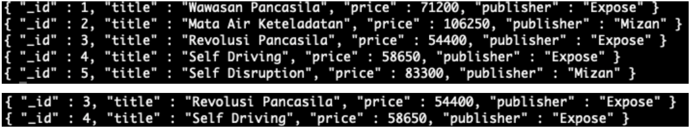

# Task: Introduction No SQL & Mongo DB 

## Problem 1 : Create, Read, Update and Delete

### Prepare :
a. Create User
```console
> db.createUser( { user: "jabbar", pwd: "******", roles: [ { role: "dbAdmin", db: "digital_outlet" } ] } )

# Output :
Successfully added user: {
    "user" : "jabbar",
    "roles" : [
        {
            "role" : "dbAdmin",
            "db" : "digital_outlet"
        }
    ]
}
```

b. Login menggunakan User
```console
root@MSI:/# mongo -u jabbar -p ****** 127.0.0.1:27017/digital_outlet

# Output :
MongoDB shell version v4.0.28
connecting to: mongodb://127.0.0.1:27017/digital_outlet?gssapiServiceName=mongodb
Implicit session: session { "id" : UUID("3b7b4da8-17f1-4b3a-b115-fec050197a49") }
MongoDB server version: 6.0.0
WARNING: shell and server versions do not match
Server has startup warnings:
{"t":{"$date":"2022-07-26T05:40:24.133+07:00"},"s":"W",  "c":"CONTROL",  "id":22120,   "ctx":"initandlisten","msg":"Access control is not enabled for the database. Read and write access to data and configuration is unrestricted","tags":["startupWarnings"]}
```
c. Create or Use Database
```console
> use digital_outlet

# Output :
switched to db digital_outlet
```

### Create
#### a. insert 5 operators pada table operators
```console
digital_outlet> db.createCollection("operators")

# Output :
{ "ok" : 1 }

digital_outlet> db.operators.insertMany( [
    { name: "Telkomsel" },
    { name: "Indosat" },
    { name: "Tri" },
    { name: "Axis" },
    { name: "XL" }
    ]  )
	
# Output :
BulkWriteResult({
    "writeErrors" : [ ],
    "writeConcernErrors" : [ ],
    "ninsertManyed" : 5,
    "nUpserted" : 0,
    "nMatched" : 0,
    "nModified" : 0,
    "nRemoved" : 0,
    "upserted" : [ ]
})
```

#### b. insert 3 product type
```console
digital_outlet> db.createCollection("product_types")

# Output :
{ "ok" : 1 }

digital_outlet> db.product_types.insertMany( [
    { name: "Kartu Perdana" },
    { name: "Pulsa" },
    { name: "Paket Data" }
    ]  )
	
# Output :
BulkWriteResult({
    "writeErrors" : [ ],
    "writeConcernErrors" : [ ],
    "ninsertManyed" : 3,
    "nUpserted" : 0,
    "nMatched" : 0,
    "nModified" : 0,
    "nRemoved" : 0,
    "upserted" : [ ]
})
```

#### c. insert 2 product dengan product type id = 1, dan operators id = 3
```console
digital_outlet> db.createCollection("products")

# Output :
{ "ok" : 1 }

digital_outlet> db.products.insertMany( [
    { id: 1, product_type_id: 1, operator_id: 3, code: "PRDN001", name: "Perdana Tri 100.000" },
    { id: 2, product_type_id: 1, operator_id: 3, code: "PRDN002", name: "Perdana Tri 200.000" }
    ] )
	
# Output :
BulkWriteResult({
    "writeErrors" : [ ],
    "writeConcernErrors" : [ ],
    "ninsertManyed" : 2,
    "nUpserted" : 0,
    "nMatched" : 0,
    "nModified" : 0,
    "nRemoved" : 0,
    "upserted" : [ ]
})
```

#### d. insert 3 product dengan product type id = 2, dan operators id = 1
```console
digital_outlet> db.products.insertMany( [
    { id: 3, product_type_id: 2, operator_id: 1, code: "PLSTLK005", name: "Pulsa Telkomsel 5.000" },
    { id: 4, product_type_id: 2, operator_id: 1, code: "PLSTLK010", name: "Pulsa Telkomsel 10.000" },
    { id: 5, product_type_id: 2, operator_id: 1, code: "PLSTLK020", name: "Pulsa Telkomsel 20.000" }
    ] )
	
# Output :
BulkWriteResult({
    "writeErrors" : [ ],
    "writeConcernErrors" : [ ],
    "ninsertManyed" : 3,
    "nUpserted" : 0,
    "nMatched" : 0,
    "nModified" : 0,
    "nRemoved" : 0,
    "upserted" : [ ]
})
```

#### e. insert 3 product dengan product type id = 3, dan operators id = 4
```console
digital_outlet> db.products.insertMany( [
    { id: 6, product_type_id: 3, operator_id: 4, code: "INETAX1GB", name: "Paket Internet Axis 1GB" },
    { id: 7, product_type_id: 3, operator_id: 4, code: "INETAX2GB", name: "Paket Internet Axis 2GB" },
    { id: 8, product_type_id: 3, operator_id: 4, code: "INETAX4GB", name: "Paket Internet Axis 4GB" }
    ] )
	
# Output :
BulkWriteResult({
    "writeErrors" : [ ],
    "writeConcernErrors" : [ ],
    "ninsertManyed" : 3,
    "nUpserted" : 0,
    "nMatched" : 0,
    "nModified" : 0,
    "nRemoved" : 0,
    "upserted" : [ ]
})
```

#### f. insert product description pada setiap product
```console
digital_outlet> db.createCollection("product_description")

# Output :
{ "ok" : 1 }

digital_outlet> db.product_description.insertMany( [
    { id: 1, product_id: 1, description: "Masa Berlaku 1 Hari" },
    { id: 2, product_id: 2, description: "Masa Berlaku 3 Hari" },
    { id: 3, product_id: 3, description: "Masa Berlaku 5 Hari" },
    { id: 4, product_id: 4, description: "Masa Berlaku 10 Hari" },
    { id: 5, product_id: 5, description: "Masa Berlaku 15 Hari" },
    { id: 6, product_id: 6, description: "Masa Berlaku 24 Jam" },
    { id: 7, product_id: 7, description: "Masa Berlaku 24 Jam" },
    { id: 8, product_id: 8, description: "Masa Berlaku 24 Jam" }
    ] )
	
# Output :
BulkWriteResult({
    "writeErrors" : [ ],
    "writeConcernErrors" : [ ],
    "ninsertManyed" : 8,
    "nUpserted" : 0,
    "nMatched" : 0,
    "nModified" : 0,
    "nRemoved" : 0,
    "upserted" : [ ]
})
```

#### g. insert 3 payment methods
```console
digital_outlet> db.createCollection("payment_methods")

# Output :
{ "ok" : 1 }

digital_outlet> db.payment_methods.insertMany( [
    { id: 1, name: "Cash" },
    { id: 2, name: "QRIS" },
    { id: 3, name: "Virtual Account Mandiri" }
    ] )
	
# Output :
BulkWriteResult({
    "writeErrors" : [ ],
    "writeConcernErrors" : [ ],
    "ninsertManyed" : 3,
    "nUpserted" : 0,
    "nMatched" : 0,
    "nModified" : 0,
    "nRemoved" : 0,
    "upserted" : [ ]
})
```


#### h. insert 5 user pada table user
```console
digital_outlet> db.createCollection("users")

# Output :
{ "ok" : 1 }

digital_outlet> db.users.insertMany( [
    { id: 1, name: "Fajar", address: "Jakarta", dob: "1993-07-28", status: 1, "gender": "M" },
    { id: 2, name: "Sawitry", address: "Jakarta", dob: "1995-07-24", status: 1, "gender": "F"  },
    { id: 3, name: "Rizky", address: "Jakarta", dob: "1993-06-22", status: 1, "gender": "M"  },
    { id: 4, name: "Jabbar", address: "Jakarta", dob: "1993-02-21", status: 1, "gender": "M"  },
    { id: 5, name: "Siska", address: "Jakarta", dob: "1994-07-17", status: 1, "gender": "F"  }
    ] )
	
# Output :
BulkWriteResult({
    "writeErrors" : [ ],
    "writeConcernErrors" : [ ],
    "ninsertManyed" : 5,
    "nUpserted" : 0,
    "nMatched" : 0,
    "nModified" : 0,
    "nRemoved" : 0,
    "upserted" : [ ]
})
```

#### i. insert 3 transaksi di masing-masing user.
```console
digital_outlet> db.createCollection("transactions")

# Output :
{ "ok" : 1 }

digital_outlet> db.transactions.insertMany( [
    { id: 1, user_id: 1, payment_method_id: 1, total_qty: 0, total_price: 0, status: "Lunas"},
    { id: 2, user_id: 1, payment_method_id: 1, total_qty: 0, total_price: 0, status: "Lunas"},
    { id: 3, user_id: 1, payment_method_id: 2, total_qty: 0, total_price: 0, status: "Lunas"},
    { id: 4, user_id: 2, payment_method_id: 1, total_qty: 0, total_price: 0, status: "Lunas"},
    { id: 5, user_id: 2, payment_method_id: 1, total_qty: 0, total_price: 0, status: "Lunas"},
    { id: 6, user_id: 2, payment_method_id: 2, total_qty: 0, total_price: 0, status: "Lunas"},
    { id: 7, user_id: 3, payment_method_id: 1, total_qty: 0, total_price: 0, status: "Lunas"},
    { id: 8, user_id: 3, payment_method_id: 1, total_qty: 0, total_price: 0, status: "Lunas"},
    { id: 9, user_id: 3, payment_method_id: 2, total_qty: 0, total_price: 0, status: "Lunas"},
    { id: 10, user_id: 4, payment_method_id: 1, total_qty: 0, total_price: 0, status: "Lunas"},
    { id: 11, user_id: 4, payment_method_id: 1, total_qty: 0, total_price: 0, status: "Lunas"},
    { id: 12, user_id: 4, payment_method_id: 2, total_qty: 0, total_price: 0, status: "Lunas"},
    { id: 13, user_id: 5, payment_method_id: 1, total_qty: 0, total_price: 0, status: "Lunas"},
    { id: 14, user_id: 6, payment_method_id: 1, total_qty: 0, total_price: 0, status: "Lunas"},
    { id: 15, user_id: 7, payment_method_id: 2, total_qty: 0, total_price: 0, status: "Lunas"},
])

# Output :
BulkWriteResult({
    "writeErrors" : [ ],
    "writeConcernErrors" : [ ],
    "ninsertManyed" : 15,
    "nUpserted" : 0,
    "nMatched" : 0,
    "nModified" : 0,
    "nRemoved" : 0,
    "upserted" : [ ]
})
```

#### j. insert 3 product di masing-masing transaksi.
```console
digital_outlet> db.createCollection("transaction_details")

# Output :
{ "ok" : 1 }

digital_outlet> db.transaction_details.insertMany( [
    { transaction_id: "1", product_id: "1", status: "-", qty: 1, price: 10000},
    { transaction_id: "1", product_id: "2", status: "-", qty: 1, price: 20000},
    { transaction_id: "1", product_id: "3", status: "-", qty: 1, price: 30000},
    { transaction_id: "2", product_id: "1", status: "-", qty: 1, price: 10000},
    { transaction_id: "2", product_id: "2", status: "-", qty: 1, price: 20000},
    { transaction_id: "2", product_id: "3", status: "-", qty: 1, price: 30000},
    { transaction_id: "3", product_id: "1", status: "-", qty: 1, price: 10000},
    { transaction_id: "3", product_id: "2", status: "-", qty: 1, price: 20000},
    { transaction_id: "3", product_id: "3", status: "-", qty: 1, price: 30000},
    { transaction_id: "4", product_id: "1", status: "-", qty: 1, price: 10000},
    { transaction_id: "4", product_id: "2", status: "-", qty: 1, price: 20000},
    { transaction_id: "4", product_id: "3", status: "-", qty: 1, price: 30000},
    { transaction_id: "5", product_id: "1", status: "-", qty: 1, price: 10000},
    { transaction_id: "5", product_id: "2", status: "-", qty: 1, price: 20000},
    { transaction_id: "5", product_id: "3", status: "-", qty: 1, price: 30000},
    { transaction_id: "6", product_id: "1", status: "-", qty: 1, price: 10000},
    { transaction_id: "6", product_id: "2", status: "-", qty: 1, price: 20000},
    { transaction_id: "6", product_id: "3", status: "-", qty: 1, price: 30000},
    { transaction_id: "7", product_id: "1", status: "-", qty: 1, price: 10000},
    { transaction_id: "7", product_id: "2", status: "-", qty: 1, price: 20000},
    { transaction_id: "7", product_id: "3", status: "-", qty: 1, price: 30000},
    { transaction_id: "8", product_id: "1", status: "-", qty: 1, price: 10000},
    { transaction_id: "8", product_id: "2", status: "-", qty: 1, price: 20000},
    { transaction_id: "8", product_id: "3", status: "-", qty: 1, price: 30000},
    { transaction_id: "9", product_id: "1", status: "-", qty: 1, price: 10000},
    { transaction_id: "9", product_id: "2", status: "-", qty: 1, price: 20000},
    { transaction_id: "9", product_id: "3", status: "-", qty: 1, price: 30000},
    { transaction_id: "10", product_id: "1", status: "-", qty: 1, price: 10000},
    { transaction_id: "10", product_id: "2", status: "-", qty: 1, price: 20000},
    { transaction_id: "10", product_id: "3", status: "-", qty: 1, price: 30000},
    { transaction_id: "11", product_id: "1", status: "-", qty: 1, price: 10000},
    { transaction_id: "11", product_id: "2", status: "-", qty: 1, price: 20000},
    { transaction_id: "11", product_id: "3", status: "-", qty: 1, price: 30000},
    { transaction_id: "12", product_id: "1", status: "-", qty: 1, price: 10000},
    { transaction_id: "12", product_id: "2", status: "-", qty: 1, price: 20000},
    { transaction_id: "12", product_id: "3", status: "-", qty: 1, price: 30000},
    { transaction_id: "13", product_id: "1", status: "-", qty: 1, price: 10000},
    { transaction_id: "13", product_id: "2", status: "-", qty: 1, price: 20000},
    { transaction_id: "13", product_id: "3", status: "-", qty: 1, price: 30000},
    { transaction_id: "14", product_id: "1", status: "-", qty: 1, price: 10000},
    { transaction_id: "14", product_id: "2", status: "-", qty: 1, price: 20000},
    { transaction_id: "14", product_id: "3", status: "-", qty: 1, price: 30000},
    { transaction_id: "15", product_id: "1", status: "-", qty: 1, price: 10000},
    { transaction_id: "15", product_id: "2", status: "-", qty: 1, price: 20000},
    { transaction_id: "15", product_id: "3", status: "-", qty: 1, price: 30000}
    ])
	
# Output :
BulkWriteResult({
    "writeErrors" : [ ],
    "writeConcernErrors" : [ ],
    "ninsertManyed" : 45,
    "nUpserted" : 0,
    "nMatched" : 0,
    "nModified" : 0,
    "nRemoved" : 0,
    "upserted" : [ ]
})
```


### Read
#### a. Tampilkan nama user dengan gender Laki-Laki / M
```console
digital_outlet> db.users.find({gender: "M"})

# Output :
{ "_id" : ObjectId("62dfc6e22798d62970d001f6"), "id" : 1, "name" : "Fajar", "address" : "Jakarta", "dob" : "1993-07-28", "status" : 1, "gender" : "M" }
{ "_id" : ObjectId("62dfc6e22798d62970d001f8"), "id" : 3, "name" : "Rizky", "address" : "Jakarta", "dob" : "1993-06-22", "status" : 1, "gender" : "M" }
{ "_id" : ObjectId("62dfc6e22798d62970d001f9"), "id" : 4, "name" : "Jabbar", "address" : "Jakarta", "dob" : "1993-02-21", "status" : 1, "gender" : "M" }
```

#### b. Tampilkan product dengan id = 3
```console
digital_outlet> db.products.find({id: 3})

# Output :
{ "_id" : ObjectId("62dfbb5b2798d62970d001e5"), "id" : 3, "product_type_id" : 2, "operator_id" : 1, "code" : "PLSTLK005", "name" : "Pulsa Telkomsel 5.000" }
```

#### c. Hitung jumlah user dengan gender Perempuan / F
```console
digital_outlet> db.users.count({gender: "F"})

# Output :
2
```

#### d. Tampilkan data user dengan urutan sesuai nama abjad
```console
digital_outlet> db.users.find().sort( { "name": 1 } )

# Output :
{ "_id" : ObjectId("62dfc6e22798d62970d001f6"), "id" : 1, "name" : "Fajar", "address" : "Jakarta", "dob" : "1993-07-28", "status" : 1, "gender" : "M" }
{ "_id" : ObjectId("62dfc6e22798d62970d001f9"), "id" : 4, "name" : "Jabbar", "address" : "Jakarta", "dob" : "1993-02-21", "status" : 1, "gender" : "M" }
{ "_id" : ObjectId("62dfc6e22798d62970d001f8"), "id" : 3, "name" : "Rizky", "address" : "Jakarta", "dob" : "1993-06-22", "status" : 1, "gender" : "M" }
{ "_id" : ObjectId("62dfc6e22798d62970d001f7"), "id" : 2, "name" : "Sawitry", "address" : "Jakarta", "dob" : "1995-07-24", "status" : 1, "gender" : "F" }
{ "_id" : ObjectId("62dfc6e22798d62970d001fa"), "id" : 5, "name" : "Siska", "address" : "Jakarta", "dob" : "1994-07-17", "status" : 1, "gender" : "F" }
```

#### e. Tampilkan 5 data product
```console
digital_outlet> db.products.find().limit(5)

# Output :
{ "_id" : ObjectId("62dfbb442798d62970d001e3"), "id" : 1, "product_type_id" : 1, "operator_id" : 3, "code" : "PRDN001", "name" : "Perdana Tri 100.000" },
{ "_id" : ObjectId("62dfbb442798d62970d001e4"), "id" : 2, "product_type_id" : 1, "operator_id" : 3, "code" : "PRDN002", "name" : "Perdana Tri 200.000" },
{ "_id" : ObjectId("62dfbb5b2798d62970d001e5"), "id" : 3, "product_type_id" : 2, "operator_id" : 1, "code" : "PLSTLK005", "name" : "Pulsa Telkomsel 5.000" },
{ "_id" : ObjectId("62dfbb5b2798d62970d001e6"), "id" : 4, "product_type_id" : 2, "operator_id" : 1, "code" : "PLSTLK010", "name" : "Pulsa Telkomsel 10.000" },
{ "_id" : ObjectId("62dfbb5b2798d62970d001e7"), "id" : 5, "product_type_id" : 2, "operator_id" : 1, "code" : "PLSTLK020", "name" : "Pulsa Telkomsel 20.000" }
```

### Update
#### a. Ubah data product id 1 dengan nama 'product dummy'
```console
digital_outlet> db.products.update({id: 1}, {"id" : 1, "product_type_id" : 1, "operator_id" : 3, "code" : "PRDN001", "name" : "product dummy"})

# Output :
WriteResult({ "nMatched" : 1, "nUpserted" : 0, "nModified" : 1 })
```

#### b. Ubah qty = 3 pada transaction details dengan product id 1
```console
digital_outlet> db.transaction_details.update({product_id: "1"}, {$set: { "qty" : 3}}, {multi: true })

# Output :
WriteResult({ "nMatched" : 15, "nUpserted" : 0, "nModified" : 14 })
```

### Delete
#### a. Delete data pada tabel product dengan id 1
```console
digital_outlet> db.products.remove({id: 1})

# Output :
WriteResult({ "nRemoved" : 1 })
```

#### b. Delete pada data tabel product dengan product type id 1
```console
digital_outlet> db.products.remove({product_type_id: 1}, {multi: true })

# Output :
WriteResult({ "nRemoved" : 3 })
```

************************************
************************************
************************************

# Task: Mongo DB: Advanced Query, Array, Aggregation

## Problem 2 : Aggregation MongoDB

### Prepare :

#### Books
```console
digital_outlet> db.books.insertMany([
{_id : 1, title : "Wawasan Pancasila", authorID : 1, publisherID : 1, price : 71200, stats : {page : 324, weight : 300}, publishedAt : new Date("2018-10-01"), category : ["social", "politics"]},
{_id : 2, title : "Mata Air Keteladanan", authorID : 1, publisherID : 2, price : 106250, stats : {page : 672, weight : 650}, publishedAt : new Date ("2017-09-01"), category : ["social", "politics"]},
{_id : 3, title : "Revolusi Pancasila", authorID : 1, publisherID : 1, price : 54400, stats : {page : 220, weight : 500}, publishedAt : new Date("2015-05-01"), category : ["social", "politics"]},
{_id : 4, title : "Self Driving", authorID : 2, publisherID : 1, price : 58650, stats : {page : 286, weight : 300}, publishedAt : new Date("2018-05-01"), category : ["self-development"]},
{_id : 5, title : "Self Disruption", authorID : 2, publisherID : 2, price : 83300, stats : {page : 400, weight : 800}, publishedAt : new Date("2018-05-01"), category : ["self-development"]}
])

# Output :
{
  acknowledged: true,
  insertedIds: { '0': 1, '1': 2, '2': 3, '3': 4, '4': 5 }
}
```

#### Authors
```console
digital_outlet> db.authors.insertMany([
{_id : 1, firstName : "Yudi", lastName : "Latif"}, 
{_id : 2, firstName : "Rhenald", lastName : "Kasali"} 
])

# Output :
{ acknowledged: true, insertedIds: { '0': 1, '1': 2 } }
```

#### Publishers
```console
digital_outlet> db.publishers.insertMany([
{_id : 1, publisherName : "Expose"}, 
{_id : 2, publisherName : "Mizan"} 
])

# Output :
{ acknowledged: true, insertedIds: { '0': 1, '1': 2 } }
```


### Create
#### 1. Tampilkan Gabungan data buku dari author id 1 dan author id 2.
```console
digital_outlet> db.books.find({ "authorID" : { "$in": [1, 2] } })

# Output :
[
  {
    _id: 1,
    title: 'Wawasan Pancasila',
    authorID: 1,
    publisherID: 1,
    price: 71200,
    stats: { page: 324, weight: 300 },
    publishedAt: ISODate("2018-10-01T00:00:00.000Z"),
    category: [ 'social', 'politics' ]
  },
  {
    _id: 2,
    title: 'Mata Air Keteladanan',
    authorID: 1,
    publisherID: 2,
    price: 106250,
    stats: { page: 672, weight: 650 },
    publishedAt: ISODate("2017-09-01T00:00:00.000Z"),
    category: [ 'social', 'politics' ]
  },
  {
    _id: 3,
    title: 'Revolusi Pancasila',
    authorID: 1,
    publisherID: 1,
    price: 54400,
    stats: { page: 220, weight: 500 },
    publishedAt: ISODate("2015-05-01T00:00:00.000Z"),
    category: [ 'social', 'politics' ]
  },
  {
    _id: 4,
    title: 'Self Driving',
    authorID: 2,
    publisherID: 1,
    price: 58650,
    stats: { page: 286, weight: 300 },
    publishedAt: ISODate("2018-05-01T00:00:00.000Z"),
    category: [ 'self-development' ]
  },
  {
    _id: 5,
    title: 'Self Disruption',
    authorID: 2,
    publisherID: 2,
    price: 83300,
    stats: { page: 400, weight: 800 },
    publishedAt: ISODate("2018-05-01T00:00:00.000Z"),
    category: [ 'self-development' ]
  }
]
```

#### 2. Tampilkan daftar buku dan harga author id 1.
```console
digital_outlet> db.books.find({ "authorID" : 1},{"title":1, "price":1})

# Output :
[
  { _id: 1, title: 'Wawasan Pancasila', price: 71200 },
  { _id: 2, title: 'Mata Air Keteladanan', price: 106250 },
  { _id: 3, title: 'Revolusi Pancasila', price: 54400 }
]
```

#### 3. Tampilkan total jumlah halaman buku author id 2
```console
db.books.aggregate([ 
	{$match:
		{authorID: 2}
	},
	{$group: 
		{_id: "$authorID", 
			totalPages: { 
				$sum: "$stats.page" 
			}
		}
	}
])

# Output :
[ { _id: 2, totalPages: 686 } ]
```

#### 4. Tampilkan semua field books and authors terkait

##### Output 1
```console
digital_outlet> db.authors.aggregate([ { $lookup: { from: "books", localField: "_id", foreign Field: "authorID", as: "books" } }])

# Output :
[
  {
    _id: 1,
    firstName: 'Yudi',
    lastName: 'Latif',
    books: [
      {
        _id: 1,
        title: 'Wawasan Pancasila',
        authorID: 1,
        publisherID: 1,
        price: 71200,
        stats: { page: 324, weight: 300 },
        publishedAt: ISODate("2018-10-01T00:00:00.000Z"),
        category: [ 'social', 'politics' ]
      },
      {
        _id: 2,
        title: 'Mata Air Keteladanan',
        authorID: 1,
        publisherID: 2,
        price: 106250,
        stats: { page: 672, weight: 650 },
        publishedAt: ISODate("2017-09-01T00:00:00.000Z"),
        category: [ 'social', 'politics' ]
      },
      {
        _id: 3,
        title: 'Revolusi Pancasila',
        authorID: 1,
        publisherID: 1,
        price: 54400,
        stats: { page: 220, weight: 500 },
        publishedAt: ISODate("2015-05-01T00:00:00.000Z"),
        category: [ 'social', 'politics' ]
      }
    ]
  },
  {
    _id: 2,
    firstName: 'Rhenald',
    lastName: 'Kasali',
    books: [
      {
        _id: 4,
        title: 'Self Driving',
        authorID: 2,
        publisherID: 1,
        price: 58650,
        stats: { page: 286, weight: 300 },
        publishedAt: ISODate("2018-05-01T00:00:00.000Z"),
        category: [ 'self-development' ]
      },
      {
        _id: 5,
        title: 'Self Disruption',
        authorID: 2,
        publisherID: 2,
        price: 83300,
        stats: { page: 400, weight: 800 },
        publishedAt: ISODate("2018-05-01T00:00:00.000Z"),
        category: [ 'self-development' ]
      }
    ]
  }
]
```

##### Output 2
```console
digital_outlet> db.books.aggregate([ { $lookup: { from: "authors", localField: "authorID", foreignField: "_id", as: "authors" } }])

# Output :
[
  {
    _id: 1,
    title: 'Wawasan Pancasila',
    authorID: 1,
    publisherID: 1,
    price: 71200,
    stats: { page: 324, weight: 300 },
    publishedAt: ISODate("2018-10-01T00:00:00.000Z"),
    category: [ 'social', 'politics' ],
    authors: [ { _id: 1, firstName: 'Yudi', lastName: 'Latif' } ]
  },
  {
    _id: 2,
    title: 'Mata Air Keteladanan',
    authorID: 1,
    publisherID: 2,
    price: 106250,
    stats: { page: 672, weight: 650 },
    publishedAt: ISODate("2017-09-01T00:00:00.000Z"),
    category: [ 'social', 'politics' ],
    authors: [ { _id: 1, firstName: 'Yudi', lastName: 'Latif' } ]
  },
  {
    _id: 3,
    title: 'Revolusi Pancasila',
    authorID: 1,
    publisherID: 1,
    price: 54400,
    stats: { page: 220, weight: 500 },
    publishedAt: ISODate("2015-05-01T00:00:00.000Z"),
    category: [ 'social', 'politics' ],
    authors: [ { _id: 1, firstName: 'Yudi', lastName: 'Latif' } ]
  },
  {
    _id: 4,
    title: 'Self Driving',
    authorID: 2,
    publisherID: 1,
    price: 58650,
    stats: { page: 286, weight: 300 },
    publishedAt: ISODate("2018-05-01T00:00:00.000Z"),
    category: [ 'self-development' ],
    authors: [ { _id: 2, firstName: 'Rhenald', lastName: 'Kasali' } ]
  },
  {
    _id: 5,
    title: 'Self Disruption',
    authorID: 2,
    publisherID: 2,
    price: 83300,
    stats: { page: 400, weight: 800 },
    publishedAt: ISODate("2018-05-01T00:00:00.000Z"),
    category: [ 'self-development' ],
    authors: [ { _id: 2, firstName: 'Rhenald', lastName: 'Kasali' } ]
  }
]
```


#### 5. Tampilkan semua field books, authors dan publishers terkait
```console
digital_outlet> db.books.aggregate([ 
	{ 
		$lookup: { 
			from: "authors", 
			localField: "authorID", foreignField: "_id", as: "author" 
		}
	},
	{
		$unwind: "$author"
	},
	{
		$lookup: { 
			from: "publishers", localField: "publisherID", foreignField: "_id", as: "publisher" 
		} 
	},
	{
		$unwind: "$publisher"
	}
])

# Output :
[
  {
    _id: 1,
    title: 'Wawasan Pancasila',
    authorID: 1,
    publisherID: 1,
    price: 71200,
    stats: { page: 324, weight: 300 },
    publishedAt: ISODate("2018-10-01T00:00:00.000Z"),
    category: [ 'social', 'politics' ],
    author: { _id: 1, firstName: 'Yudi', lastName: 'Latif' },
    publisher: { _id: 1, publisherName: 'Expose' }
  },
  {
    _id: 2,
    title: 'Mata Air Keteladanan',
    authorID: 1,
    publisherID: 2,
    price: 106250,
    stats: { page: 672, weight: 650 },
    publishedAt: ISODate("2017-09-01T00:00:00.000Z"),
    category: [ 'social', 'politics' ],
    author: { _id: 1, firstName: 'Yudi', lastName: 'Latif' },
    publisher: { _id: 2, publisherName: 'Mizan' }
  },
  {
    _id: 3,
    title: 'Revolusi Pancasila',
    authorID: 1,
    publisherID: 1,
    price: 54400,
    stats: { page: 220, weight: 500 },
    publishedAt: ISODate("2015-05-01T00:00:00.000Z"),
    category: [ 'social', 'politics' ],
    author: { _id: 1, firstName: 'Yudi', lastName: 'Latif' },
    publisher: { _id: 1, publisherName: 'Expose' }
  },
  {
    _id: 4,
    title: 'Self Driving',
    authorID: 2,
    publisherID: 1,
    price: 58650,
    stats: { page: 286, weight: 300 },
    publishedAt: ISODate("2018-05-01T00:00:00.000Z"),
    category: [ 'self-development' ],
    author: { _id: 2, firstName: 'Rhenald', lastName: 'Kasali' },
    publisher: { _id: 1, publisherName: 'Expose' }
  },
  {
    _id: 5,
    title: 'Self Disruption',
    authorID: 2,
    publisherID: 2,
    price: 83300,
    stats: { page: 400, weight: 800 },
    publishedAt: ISODate("2018-05-01T00:00:00.000Z"),
    category: [ 'self-development' ],
    author: { _id: 2, firstName: 'Rhenald', lastName: 'Kasali' },
    publisher: { _id: 2, publisherName: 'Mizan' }
  }
]
```

#### 6. Tampilkan summary data authors, books dan publishers sesuai output

``` console

```
Output yang diminta :



#### 7. Digital_outlet ingin memberikan diskon untuk setiap buku, diskon ditentukan melihat harga buku tersebut dengan pembagian seperti ini.

<table>
<tr><td> Price < 60.000 </td><td> 1% </td></tr>
<tr><td> 60.000 < Price < 90.000 </td><td> 2% </td></tr>
<tr><td> 90.000 < Price </td><td> 3% </td></tr>
</table>

``` console

```
Output yang diminta :


#### 8. Tampilkan semua nama buku, harga, nama author dan nama publisher, urutkan dari harga termahal ke termurah

``` console

```
Output yang diminta :


#### 9. Tampilkan data nama buku harga dan publisher, kemudian tampilkan hanya data ke 3 dan ke 4

``` console

```

Output yang diminta :

