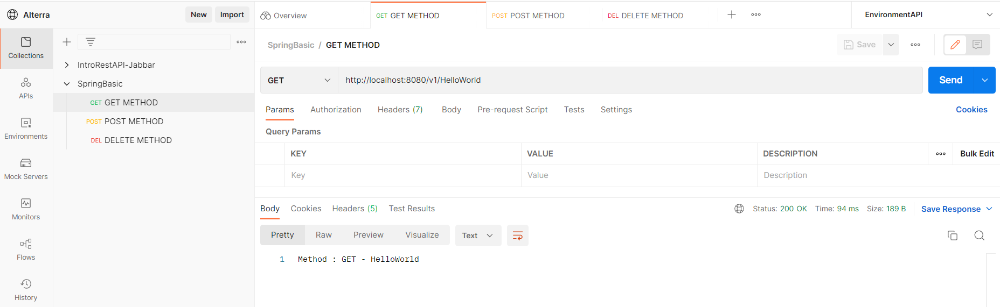
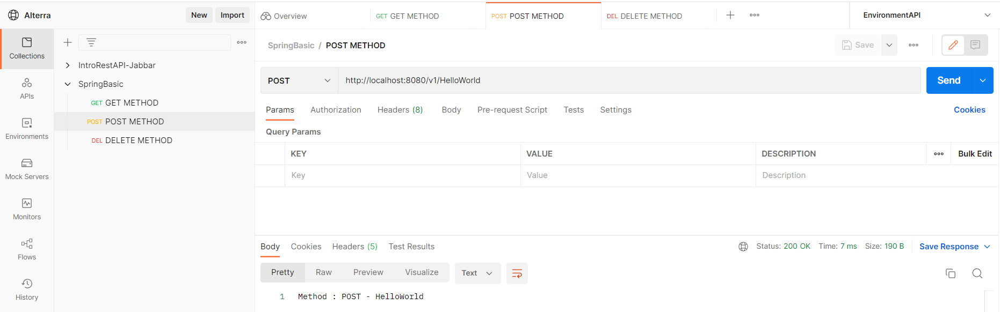
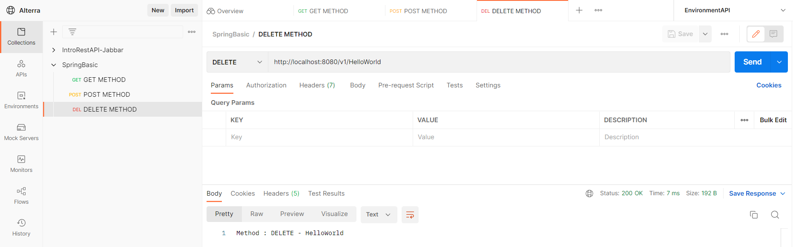

### Objective 
* Serve HTTP using Springboot 
* Implement HTTP Method 

### Problem 1 - Say Hello from Springboot 
Buatlah project Springboot yang dapat menampilkan pesan hello world dalam 3 endpoint berikut! 
* a. GET /v1/messages 
* b. POST /v1/messages 
* c. DELETE /v1/messages 

``` java
package com.mashumabduljabbar.springboothelloworld;

import org.springframework.web.bind.annotation.DeleteMapping;
import org.springframework.web.bind.annotation.GetMapping;
import org.springframework.web.bind.annotation.PathVariable;
import org.springframework.web.bind.annotation.PostMapping;
import org.springframework.web.bind.annotation.RestController;

@RestController
public class HelloController {

	@GetMapping("/v1/{messages}")
	public String gethello(@PathVariable(value="messages") String param) {
		return "Method : GET - "+param;
	}  
	@PostMapping("/v1/{messages}")
	public String posthello(@PathVariable(value="messages") String param) {
		return "Method : POST - "+param;
	}  
	@DeleteMapping("/v1/{messages}")
	public String deletehello(@PathVariable(value="messages") String param) {
		return "Method : DELETE - "+param;
	}  
	
}
```

### Problem 2- Endpoint Description 
Dari 3 endpoint tersebut, jelaskan masing-masing perbedaannya!

#### GET
Metode Get pada umumnya digunakan untuk read data baik keseluruhan ataupun data tertentu menggunakan parameter.


#### POST
Metode Post pada umumnya digunakan untuk create data.


#### DELETE
Metode Delete pada umumnya digunakan untuk menghapus data.
