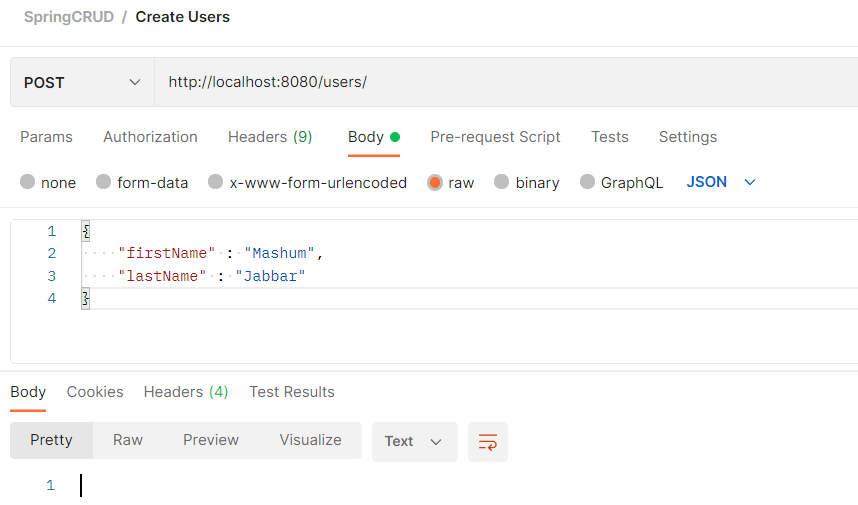
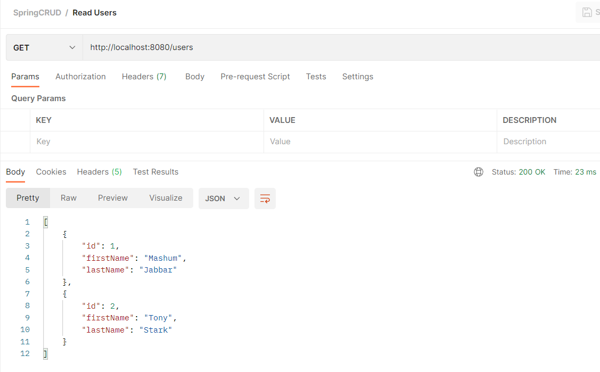
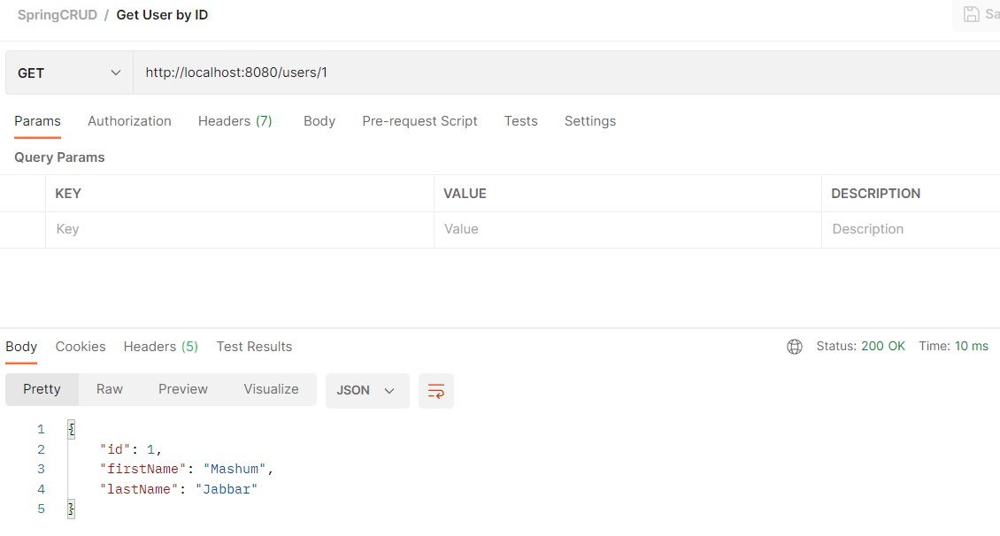
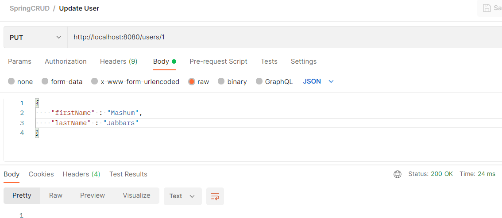
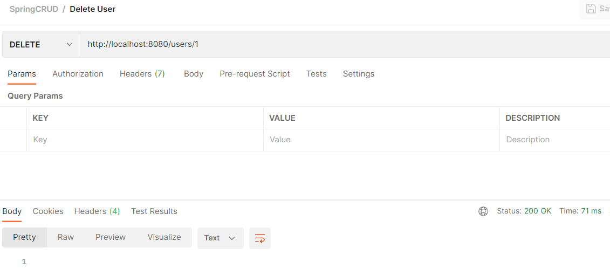

### Database 
``` sql
mysql> CREATE DATABASE `db_spring` /*!40100 COLLATE 'utf8mb4_general_ci' */;
USE `db_spring`;

mysql> CREATE TABLE `users` (
	`id` INT(11) NOT NULL AUTO_INCREMENT,
	`first_name` VARCHAR(50) NULL DEFAULT NULL COLLATE 'utf8mb4_general_ci',
	`last_name` VARCHAR(50) NULL DEFAULT NULL COLLATE 'utf8mb4_general_ci',
	PRIMARY KEY (`id`) USING BTREE
)
COLLATE='utf8mb4_general_ci'
ENGINE=InnoDB
;

mysql> CREATE USER 'alterra'@'localhost' IDENTIFIED BY 'spring2022';

mysql> GRANT ALL PRIVILEGES ON db_spring . * TO 'alterra'@'localhost';

mysql> FLUSH PRIVILEGES;
```

### Spring Boot : 
1. Buka https://start.spring.io/
2. Dependencies : Spring Web, Spring Data JPA, MySQL Driver
3. Unduh dan buka di IDE

### Configure Data Source Properties
``` properties
spring.jpa.hibernate.ddl-auto=none
spring.datasource.url=jdbc:mysql://localhost:3306/db_spring
spring.datasource.username=alterra
spring.datasource.password=spring2022
```

### Create User Model
``` java
package com.example.demo.model;

import javax.persistence.*;

@Entity
@Table(name = "users")
public class User {
    private int id;
    private String firstName;
    private String lastName;

    public User() {
    }

    public User(int id, String firstName, String lastName) {
        this.id = id;
        this.firstName = firstName;
        this.lastName = lastName;
    }
    @Id
    @GeneratedValue(strategy = GenerationType.IDENTITY)
    public int getId() {
        return id;
    }

    public void setId(int id) {
        this.id = id;
    }

    public String getFirstName() {
        return firstName;
    }

    public void setFirstName(String firstName) {
        this.firstName = firstName;
    }

    public String getLastName() {
        return lastName;
    }

    public void setLastName(String lastName) {
        this.lastName = lastName;
    }
}
```

### Create Repository Interface
``` java
package com.example.demo.repository;

import com.example.demo.model.User;
import org.springframework.data.jpa.repository.JpaRepository;

public interface UserRepository extends JpaRepository<User, Integer> {
}
```

### Create User Service 
``` java
package com.example.demo.service;

import com.example.demo.model.User;
import com.example.demo.repository.UserRepository;
import org.springframework.beans.factory.annotation.Autowired;
import org.springframework.stereotype.Service;

import javax.transaction.Transactional;
import java.util.List;
@Service
@Transactional
public class UserService {
    @Autowired
    private UserRepository userRepository;
    public List<User> listAllUser() {
        return userRepository.findAll();
    }

    public void saveUser(User user) {
        userRepository.save(user);
    }

    public User getUser(Integer id) {
        return userRepository.findById(id).get();
    }

    public void deleteUser(Integer id) {
        userRepository.deleteById(id);
    }
}
```


### Create User Controller 
``` java
package com.example.demo.controller;

import com.example.demo.model.User;
import com.example.demo.service.UserService;
import org.springframework.beans.factory.annotation.Autowired;
import org.springframework.http.HttpStatus;
import org.springframework.http.ResponseEntity;
import org.springframework.web.bind.annotation.*;

import java.util.List;
import java.util.NoSuchElementException;

@RestController
@RequestMapping("/users")
public class UserController {
    @Autowired
    UserService userService;

    @GetMapping("")
    public List<User> list() {
        return userService.listAllUser();
    }

    @GetMapping("/{id}")
    public ResponseEntity<User> get(@PathVariable Integer id) {
        try {
            User user = userService.getUser(id);
            return new ResponseEntity<User>(user, HttpStatus.OK);
        } catch (NoSuchElementException e) {
            return new ResponseEntity<User>(HttpStatus.NOT_FOUND);
        }
    }
    @PostMapping("/")
    public void add(@RequestBody User user) {
        userService.saveUser(user);
    }
    @PutMapping("/{id}")
    public ResponseEntity<?> update(@RequestBody User user, @PathVariable Integer id) {
        try {
            User existUser = userService.getUser(id);
            user.setId(id);
            userService.saveUser(user);
            return new ResponseEntity<>(HttpStatus.OK);
        } catch (NoSuchElementException e) {
            return new ResponseEntity<>(HttpStatus.NOT_FOUND);
        }
    }
    @DeleteMapping("/{id}")
    public void delete(@PathVariable Integer id) {

        userService.deleteUser(id);
    }
}
```

### Create Spring Boot Application Class
``` java
package com.example.demo;

import org.springframework.boot.SpringApplication;
import org.springframework.boot.autoconfigure.SpringBootApplication;
 
@SpringBootApplication
public class Application {
 
    public static void main(String[] args) {
        SpringApplication.run(Application.class, args);
    }
 
}
```

### Run Application Spring Java lalu Buka Postman

##### CREATE Users


##### READ Users


##### GET User


##### UPDATE User


##### DELETE User
