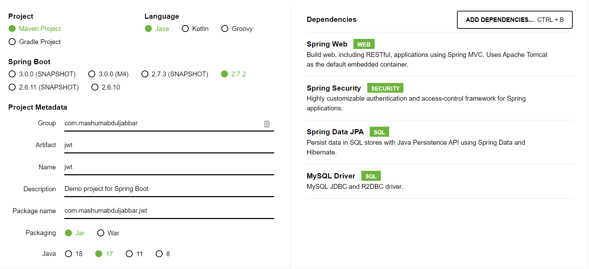

## Database 
``` sql
mysql> CREATE DATABASE `db_spring` /*!40100 COLLATE 'utf8mb4_general_ci' */;
USE `db_spring`;

mysql> CREATE USER 'alterra'@'localhost' IDENTIFIED BY 'spring2022';

mysql> GRANT ALL PRIVILEGES ON db_spring . * TO 'alterra'@'localhost';

mysql> FLUSH PRIVILEGES;
```

## Spring
### Spring Boot : 
1. Buka https://start.spring.io/
2. Dependencies : Spring Web, Spring Security, Spring Data JPA, MySQL Driver
3. Unduh dan buka di IDE


### Tambahkan Dependency JJWT di POM.XML
``` xml
		<dependency>
			<groupId>io.jsonwebtoken</groupId>
			<artifactId>jjwt</artifactId>
			<version>0.9.1</version>
		</dependency>
```

### Configure Data Source Properties
``` properties
spring.main.allow-circular-references=true

## Spring DATASOURCE (DataSourceAutoConfiguration & DataSourceProperties)
spring.datasource.url = jdbc:mysql://localhost:3306/db_spring?createDatabaseIfNotExist=true&allowPublicKeyRetrieval=true&useSSL=false
spring.datasource.username = alterra
spring.datasource.password = spring2022

## Hibernate Properties
# The SQL dialect makes Hibernate generate better SQL for the chosen database
spring.jpa.properties.hibernate.dialect = org.hibernate.dialect.MySQL8Dialect

# Hibernate ddl auto (create, create-drop, validate, update)
spring.jpa.hibernate.ddl-auto = create-drop
```

## Model
### Create UserDao.java
``` java
package com.mashumabduljabbar.jwt.model;
import com.fasterxml.jackson.annotation.JsonIgnore;

import javax.persistence.*;

@Entity
@Table(name = "user")
public class UserDao {
    @Id
    @GeneratedValue(strategy = GenerationType.IDENTITY)
    private long id;
    @Column
    private String username;
    @Column
    @JsonIgnore
    private String password;

    public String getUsername() {
        return username;
    }

    public void setUsername(String username) {
        this.username = username;
    }

    public String getPassword() {
        return password;
    }

    public void setPassword(String password) {
        this.password = password;
    }

}
```

### Create UserDto.java
``` Java
package com.mashumabduljabbar.jwt.model;

public class UserDto {
    private String username;
    private String password;

    public String getUsername() {
        return username;
    }

    public void setUsername(String username) {
        this.username = username;
    }

    public String getPassword() {
        return password;
    }

    public void setPassword(String password) {
        this.password = password;
    }
}
```

### Create JwtRequest.java
``` Java
package com.mashumabduljabbar.jwt.model;

import java.io.Serializable;

public class JwtRequest implements Serializable {

	private static final long serialVersionUID = 5926468583005150707L;
	
	private String username;
	private String password;
	
	//default constructor for JSON Parsing
	public JwtRequest()
	{
	}

	public JwtRequest(String username, String password) {
		this.setUsername(username);
		this.setPassword(password);
	}

	public String getUsername() {
		return this.username;
	}

	public void setUsername(String username) {
		this.username = username;
	}

	public String getPassword() {
		return this.password;
	}

	public void setPassword(String password) {
		this.password = password;
	}
}
```

### Create JwtResponse.java
``` Java
package com.mashumabduljabbar.jwt.model;

import java.io.Serializable;

public class JwtResponse implements Serializable {

	private static final long serialVersionUID = -8091879091924046844L;
	private final String jwttoken;

	public JwtResponse(String jwttoken) {
		this.jwttoken = jwttoken;
	}

	public String getToken() {
		return this.jwttoken;
	}
}
```

## Repository

### Create UserRepository.java
``` java
package com.mashumabduljabbar.jwt.repository;
import org.springframework.data.repository.CrudRepository;

import com.mashumabduljabbar.jwt.model.UserDao;
public interface UserRepository extends CrudRepository<UserDao, Integer> {
    UserDao findByUsername(String username);
}
```

## Service
### Create JwtUserDetailsService.java
```java
package com.mashumabduljabbar.jwt.service;

import com.mashumabduljabbar.jwt.model.UserDao;
import com.mashumabduljabbar.jwt.model.UserDto;
import com.mashumabduljabbar.jwt.repository.UserRepository;

import org.springframework.beans.factory.annotation.Autowired;
import org.springframework.security.core.userdetails.UserDetails;
import org.springframework.security.core.userdetails.UserDetailsService;
import org.springframework.security.core.userdetails.UsernameNotFoundException;
import org.springframework.security.crypto.password.PasswordEncoder;
import org.springframework.stereotype.Service;

import java.util.ArrayList;

@Service
public class JwtUserDetailsService implements UserDetailsService {
	@Autowired
	private UserRepository userDao;

	@Autowired
	private PasswordEncoder bcryptEncoder;

	@Override
	public UserDetails loadUserByUsername(String username) throws UsernameNotFoundException {
		UserDao user = userDao.findByUsername(username);
		if (user == null) {
			throw new UsernameNotFoundException("User not found with username: " + username);
		}
		return new org.springframework.security.core.userdetails.User(user.getUsername(), user.getPassword(),
				new ArrayList<>());
	}

	public UserDao save(UserDto user) {
		UserDao newUser = new UserDao();
		newUser.setUsername(user.getUsername());
		newUser.setPassword(bcryptEncoder.encode(user.getPassword()));
		return userDao.save(newUser);
	}
}
```

## Config
### Create WebSecurityConfig.java
``` java
package com.mashumabduljabbar.jwt.config;

import org.springframework.beans.factory.annotation.Autowired;
import org.springframework.context.annotation.Bean;
import org.springframework.context.annotation.Configuration;
import org.springframework.security.authentication.AuthenticationManager;
import org.springframework.security.config.annotation.authentication.builders.AuthenticationManagerBuilder;
import org.springframework.security.config.annotation.method.configuration.EnableGlobalMethodSecurity;
import org.springframework.security.config.annotation.web.builders.HttpSecurity;
import org.springframework.security.config.annotation.web.configuration.EnableWebSecurity;
import org.springframework.security.config.annotation.web.configuration.WebSecurityConfigurerAdapter;
import org.springframework.security.config.http.SessionCreationPolicy;
import org.springframework.security.core.userdetails.UserDetailsService;
import org.springframework.security.crypto.bcrypt.BCryptPasswordEncoder;
import org.springframework.security.crypto.password.PasswordEncoder;
import org.springframework.security.web.authentication.UsernamePasswordAuthenticationFilter;

@Configuration
@EnableWebSecurity
@EnableGlobalMethodSecurity(prePostEnabled = true)
public class WebSecurityConfig extends WebSecurityConfigurerAdapter {

	@Autowired
	private JwtAuthenticationEntryPoint jwtAuthenticationEntryPoint;

	@Autowired
	private UserDetailsService jwtUserDetailsService;

	@Autowired
	private JwtRequestFilter jwtRequestFilter;

	@Autowired
	public void configureGlobal(AuthenticationManagerBuilder auth) throws Exception {
		// configure AuthenticationManager so that it knows from where to load
		// user for matching credentials
		// Use BCryptPasswordEncoder
		auth.userDetailsService(jwtUserDetailsService).passwordEncoder(passwordEncoder());
	}

	@Bean
	public PasswordEncoder passwordEncoder() {
		return new BCryptPasswordEncoder();
	}

	@Bean
	@Override
	public AuthenticationManager authenticationManagerBean() throws Exception {
		return super.authenticationManagerBean();
	}

	@Override
	protected void configure(HttpSecurity httpSecurity) throws Exception {
		// We don't need CSRF for this example
		httpSecurity.csrf().disable()
				// dont authenticate this particular request
				.authorizeRequests().antMatchers("/authenticate", "/register").permitAll().
				// all other requests need to be authenticated
						anyRequest().authenticated().and().
				// make sure we use stateless session; session won't be used to
				// store user's state.
						exceptionHandling().authenticationEntryPoint(jwtAuthenticationEntryPoint).and().sessionManagement()
				.sessionCreationPolicy(SessionCreationPolicy.STATELESS);

		// Add a filter to validate the tokens with every request
		httpSecurity.addFilterBefore(jwtRequestFilter, UsernamePasswordAuthenticationFilter.class);
	}
}
```

### Create JwtTokenUtil.java
``` java
package com.mashumabduljabbar.jwt.config;

import java.io.Serializable;
import java.util.Date;
import java.util.HashMap;
import java.util.Map;
import java.util.function.Function;

import org.springframework.beans.factory.annotation.Value;
import org.springframework.security.core.userdetails.UserDetails;
import org.springframework.stereotype.Component;

import io.jsonwebtoken.Claims;
import io.jsonwebtoken.Jwts;
import io.jsonwebtoken.SignatureAlgorithm;

@Component
public class JwtTokenUtil implements Serializable {

	private static final long serialVersionUID = -2550185165626007488L;
	
	public static final long JWT_TOKEN_VALIDITY = 5*60*60;

	@Value("${jwt.secret}")
	private String secret;

	public String getUsernameFromToken(String token) {
		return getClaimFromToken(token, Claims::getSubject);
	}

	public Date getIssuedAtDateFromToken(String token) {
		return getClaimFromToken(token, Claims::getIssuedAt);
	}

	public Date getExpirationDateFromToken(String token) {
		return getClaimFromToken(token, Claims::getExpiration);
	}

	public <T> T getClaimFromToken(String token, Function<Claims, T> claimsResolver) {
		final Claims claims = getAllClaimsFromToken(token);
		return claimsResolver.apply(claims);
	}

	private Claims getAllClaimsFromToken(String token) {
		return Jwts.parser().setSigningKey(secret).parseClaimsJws(token).getBody();
	}

	private Boolean isTokenExpired(String token) {
		final Date expiration = getExpirationDateFromToken(token);
		return expiration.before(new Date());
	}

	private Boolean ignoreTokenExpiration(String token) {
		// here you specify tokens, for that the expiration is ignored
		return false;
	}

	public String generateToken(UserDetails userDetails) {
		Map<String, Object> claims = new HashMap<>();
		return doGenerateToken(claims, userDetails.getUsername());
	}

	private String doGenerateToken(Map<String, Object> claims, String subject) {

		return Jwts.builder().setClaims(claims).setSubject(subject).setIssuedAt(new Date(System.currentTimeMillis()))
				.setExpiration(new Date(System.currentTimeMillis() + JWT_TOKEN_VALIDITY*1000)).signWith(SignatureAlgorithm.HS512, secret).compact();
	}

	public Boolean canTokenBeRefreshed(String token) {
		return (!isTokenExpired(token) || ignoreTokenExpiration(token));
	}

	public Boolean validateToken(String token, UserDetails userDetails) {
		final String username = getUsernameFromToken(token);
		return (username.equals(userDetails.getUsername()) && !isTokenExpired(token));
	}
}
```

### Create JwtRequestFilter.java
``` java
package com.mashumabduljabbar.jwt.config;

import java.io.IOException;

import javax.servlet.FilterChain;
import javax.servlet.ServletException;
import javax.servlet.http.HttpServletRequest;
import javax.servlet.http.HttpServletResponse;

import org.springframework.beans.factory.annotation.Autowired;
import org.springframework.security.authentication.UsernamePasswordAuthenticationToken;
import org.springframework.security.core.context.SecurityContextHolder;
import org.springframework.security.core.userdetails.UserDetails;
import org.springframework.security.web.authentication.WebAuthenticationDetailsSource;
import org.springframework.stereotype.Component;
import org.springframework.web.filter.OncePerRequestFilter;

import com.mashumabduljabbar.jwt.service.JwtUserDetailsService;

import io.jsonwebtoken.ExpiredJwtException;

@Component
public class JwtRequestFilter extends OncePerRequestFilter {

	@Autowired
	private JwtUserDetailsService jwtUserDetailsService;

	@Autowired
	private JwtTokenUtil jwtTokenUtil;

	@Override
	protected void doFilterInternal(HttpServletRequest request, HttpServletResponse response, FilterChain chain)
			throws ServletException, IOException {

		final String requestTokenHeader = request.getHeader("Authorization");

		String username = null;
		String jwtToken = null;
		// JWT Token is in the form "Bearer token". Remove Bearer word and get only the Token
		if (requestTokenHeader != null && requestTokenHeader.startsWith("Bearer ")) {
			jwtToken = requestTokenHeader.substring(7);
			try {
				username = jwtTokenUtil.getUsernameFromToken(jwtToken);
			} catch (IllegalArgumentException e) {
				System.out.println("Unable to get JWT Token");
			} catch (ExpiredJwtException e) {
				System.out.println("JWT Token has expired");
			}
		} else {
			logger.warn("JWT Token does not begin with Bearer String");
		}

		//Once we get the token validate it.
		if (username != null && SecurityContextHolder.getContext().getAuthentication() == null) {

			UserDetails userDetails = this.jwtUserDetailsService.loadUserByUsername(username);

			// if token is valid configure Spring Security to manually set authentication
			if (jwtTokenUtil.validateToken(jwtToken, userDetails)) {

				UsernamePasswordAuthenticationToken usernamePasswordAuthenticationToken = new UsernamePasswordAuthenticationToken(
						userDetails, null, userDetails.getAuthorities());
				usernamePasswordAuthenticationToken
						.setDetails(new WebAuthenticationDetailsSource().buildDetails(request));
				// After setting the Authentication in the context, we specify
				// that the current user is authenticated. So it passes the Spring Security Configurations successfully.
				SecurityContextHolder.getContext().setAuthentication(usernamePasswordAuthenticationToken);
			}
		}
		chain.doFilter(request, response);
	}

}
```

### Create JwtAuthenticationEntryPoint.java
``` java
package com.mashumabduljabbar.jwt.config;

import java.io.IOException;
import java.io.Serializable;

import javax.servlet.http.HttpServletRequest;
import javax.servlet.http.HttpServletResponse;

import org.springframework.security.core.AuthenticationException;
import org.springframework.security.web.AuthenticationEntryPoint;
import org.springframework.stereotype.Component;

@Component
public class JwtAuthenticationEntryPoint implements AuthenticationEntryPoint, Serializable {

	private static final long serialVersionUID = -7858869558953243875L;

	@Override
	public void commence(HttpServletRequest request, HttpServletResponse response,
			AuthenticationException authException) throws IOException {

		response.sendError(HttpServletResponse.SC_UNAUTHORIZED, "Unauthorized");
	}
}
```

## Controller
### Create JwtAuthenticationController.java
``` java
package com.mashumabduljabbar.jwt.controller;

import com.mashumabduljabbar.jwt.config.JwtTokenUtil;
import com.mashumabduljabbar.jwt.model.JwtRequest;
import com.mashumabduljabbar.jwt.model.JwtResponse;
import com.mashumabduljabbar.jwt.model.UserDto;
import com.mashumabduljabbar.jwt.service.JwtUserDetailsService;

import org.springframework.beans.factory.annotation.Autowired;
import org.springframework.http.ResponseEntity;
import org.springframework.security.authentication.AuthenticationManager;
import org.springframework.security.authentication.BadCredentialsException;
import org.springframework.security.authentication.DisabledException;
import org.springframework.security.authentication.UsernamePasswordAuthenticationToken;
import org.springframework.security.core.userdetails.UserDetails;
import org.springframework.web.bind.annotation.*;

@RestController
@CrossOrigin
public class JwtAuthenticationController {

	@Autowired
	private AuthenticationManager authenticationManager;

	@Autowired
	private JwtTokenUtil jwtTokenUtil;

	@Autowired
	private JwtUserDetailsService userDetailsService;

	@RequestMapping(value = "/authenticate", method = RequestMethod.POST)
	public ResponseEntity<?> createAuthenticationToken(@RequestBody JwtRequest authenticationRequest) throws Exception {

		authenticate(authenticationRequest.getUsername(), authenticationRequest.getPassword());

		final UserDetails userDetails = userDetailsService.loadUserByUsername(authenticationRequest.getUsername());

		final String token = jwtTokenUtil.generateToken(userDetails);

		return ResponseEntity.ok(new JwtResponse(token));
	}

	@RequestMapping(value = "/register", method = RequestMethod.POST)
	public ResponseEntity<?> saveUser(@RequestBody UserDto user) throws Exception {
		return ResponseEntity.ok(userDetailsService.save(user));
	}

	private void authenticate(String username, String password) throws Exception {
		try {
			authenticationManager.authenticate(new UsernamePasswordAuthenticationToken(username, password));
		} catch (DisabledException e) {
			throw new Exception("USER_DISABLED", e);
		} catch (BadCredentialsException e) {
			throw new Exception("INVALID_CREDENTIALS", e);
		}
	}
}
```

### Create EmployeeController.java
``` java
package com.mashumabduljabbar.jwt.controller;
import org.springframework.web.bind.annotation.CrossOrigin;
import org.springframework.web.bind.annotation.RequestMapping;
import org.springframework.web.bind.annotation.RequestMethod;
import org.springframework.web.bind.annotation.RestController;
@RestController
@CrossOrigin()
public class EmployeeController {
    @RequestMapping(value = "/greeting", method = RequestMethod.GET)
    public String getEmployees() {
        return "Welcome!";
    }
}
```


## Spring Boot Application
### JwtApplication.java
``` java
package com.mashumabduljabbar.jwt;

import org.springframework.boot.SpringApplication;
import org.springframework.boot.autoconfigure.SpringBootApplication;

@SpringBootApplication
public class JwtApplication {

	public static void main(String[] args) {
		SpringApplication.run(JwtApplication.class, args);
	}

}

```

### Run Application Spring Java lalu Buka Postman

##### CREATE Users


##### READ Users


##### GET User


##### UPDATE User


##### DELETE User
