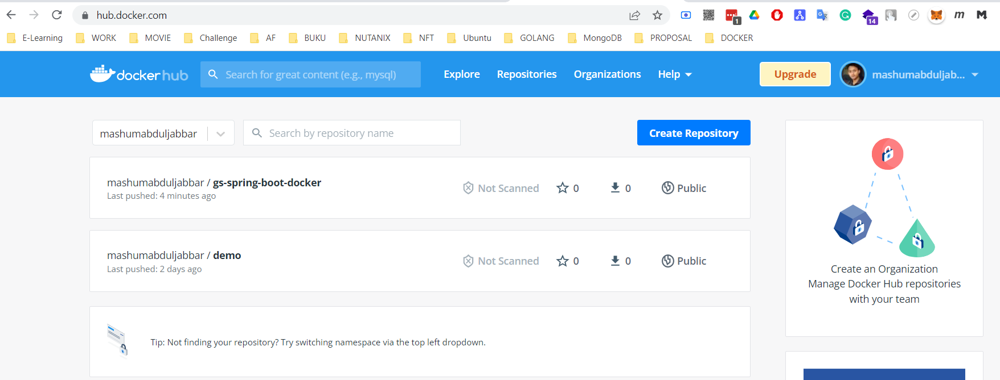
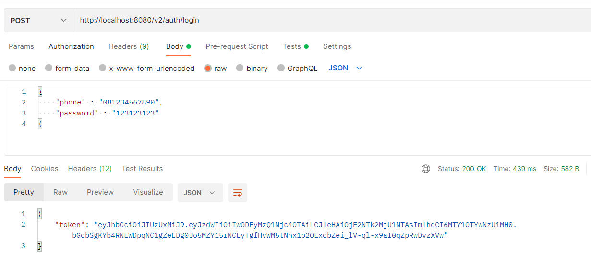

## TUGAS DOCKERIZE APPLICATION
    

#### 1. Install docker & docker compose
``` cmd
C:\WINDOWS\system32>docker version
Client:
 Cloud integration: v1.0.28
 Version:           20.10.17
 API version:       1.41
 Go version:        go1.17.11
 Git commit:        100c701
 Built:             Mon Jun  6 23:09:02 2022
 OS/Arch:           windows/amd64
 Context:           default
 Experimental:      true

Server: Docker Desktop 4.11.0 (83626)
 Engine:
  Version:          20.10.17
  API version:      1.41 (minimum version 1.12)
  Go version:       go1.17.11
  Git commit:       a89b842
  Built:            Mon Jun  6 23:01:23 2022
  OS/Arch:          linux/amd64
  Experimental:     false
 containerd:
  Version:          1.6.6
  GitCommit:        10c12954828e7c7c9b6e0ea9b0c02b01407d3ae1
 runc:
  Version:          1.1.2
  GitCommit:        v1.1.2-0-ga916309
 docker-init:
  Version:          0.19.0
  GitCommit:        de40ad0

```

``` cmd
C:\WINDOWS\system32>docker compose version
Docker Compose version v2.7.0

```

#### 2. Create dockerfile 
``` file
F:\altera\Day15-Docker\Tugas\jwt\dockerfile
```

#### 3. Clone your code and integrate to your dockerfile
``` dockerfile
FROM openjdk:8-jdk-alpine
ARG JAR_FILE=target/*.jar
COPY ${JAR_FILE} app.jar
ENTRYPOINT ["java","-jar","/app.jar"]
```

#### 4. Build your container
``` docker
F:\altera\Day15-Docker\Tugas\jwt>mvnw.cmd clean install spring-boot:repackage
F:\altera\Day15-Docker\Tugas\jwt>mvnw.cmd package && java -jar target/jwt-0.0.1-SNAPSHOT.jar

F:\altera\Day15-Docker\Tugas\jwt>docker build -t mashumabduljabbar/gs-spring-boot-docker .

```

#### 5. Push the image to docker registry
``` docker
docker push mashumabduljabbar/gs-spring-boot-docker:latest
```



#### 6. Deploy in your local machine
``` docker
docker run -p 8080:8080 -t mashumabduljabbar/gs-spring-boot-docker
```



#### 7. Try DockerCompose to run go app + mysql (opt.)
``` docker

```

#### 8. Try to Deploy in the Cloud (opt.)
``` docker

```