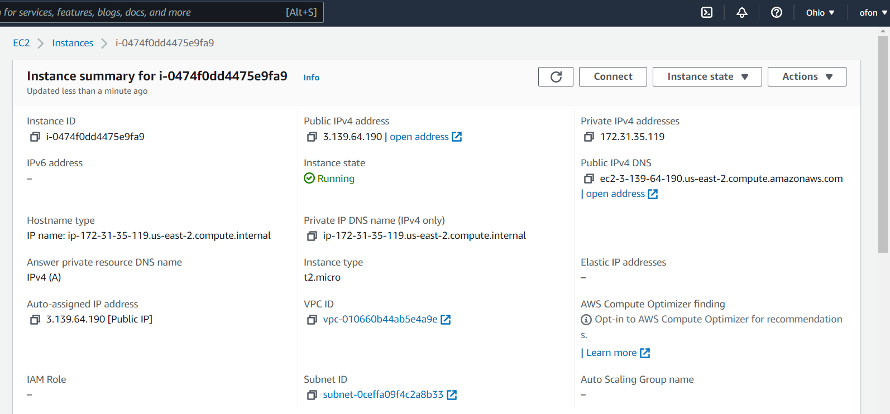
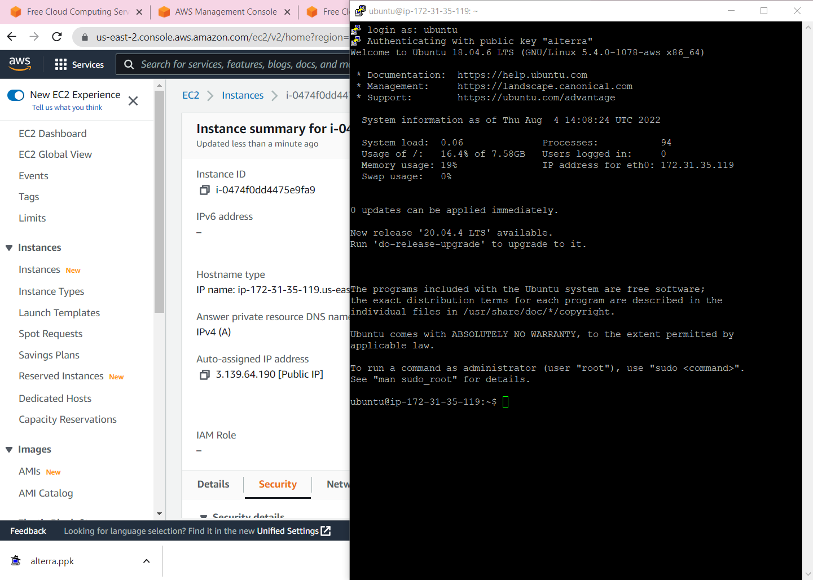
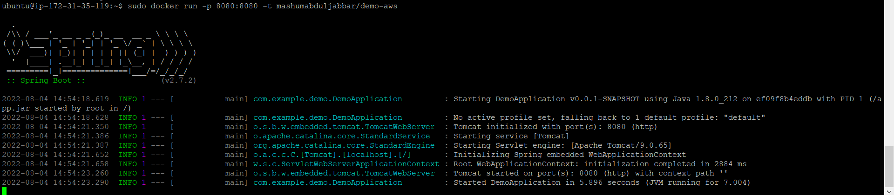
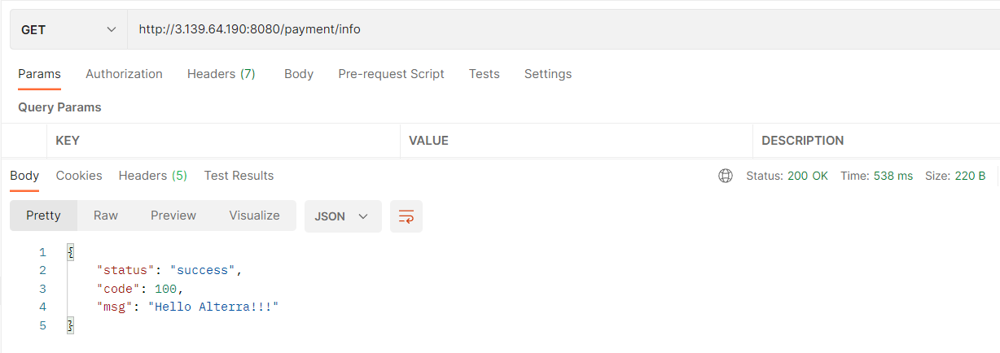

### TUGAS AWS

#### Buat VM di EC2


#### SSH ke VM
IP PUBLIC VM : 3.139.64.190
IP PRIVATE VM : 172-31-35-119



#### Deploy
``` docker
F:\altera\Day16-AWS\Tugas\demo> docker build -t mashumabduljabbar/demo-aws .
```

``` docker
F:\altera\Day16-AWS\Tugas\demo> docker push mashumabduljabbar/demo-aws:latest
```

``` ubuntu
ubuntu@ip-172-31-35-119:~$ sudo docker pull mashumabduljabbar/demo-aws
```

``` ubuntu
ubuntu@ip-172-31-35-119:~$ sudo docker run -p 8080:8080 -t mashumabduljabbar/demo-aws
```



