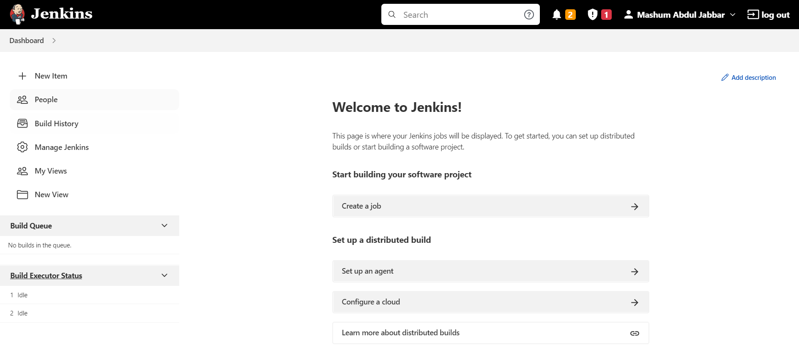
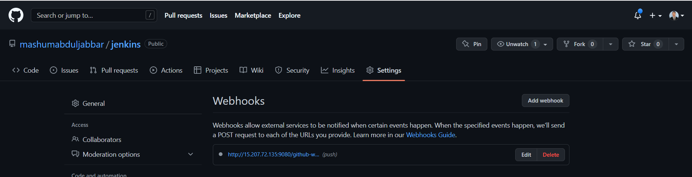
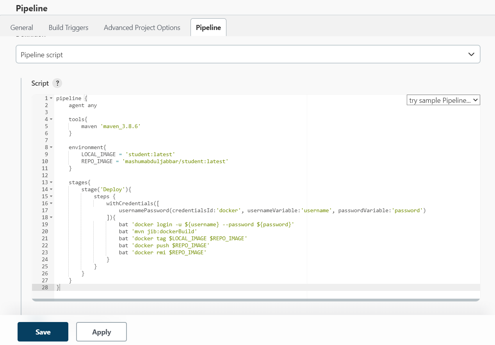

### Install and Run Jenkins
```
C:\Program Files\Jenkins>jenkins.exe start
```



### Setting Webhook Github



### Build Image Local
```
F:\altera\Day20-Microservices2\Latihan\student>docker build -t student:latest .
```

### Push Image to Dokcer Hub
```
F:\altera\Day20-Microservices2\Latihan\student>docker tag student:latest mashumabduljabbar/student:latest
```

```
F:\altera\Day20-Microservices2\Latihan\student>docker push student:latest
```

### Pipeline

