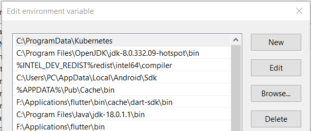

## Tugas 

### Install Kubernetes

* Download
``` powershell
curl -LO "https://dl.k8s.io/release/v1.24.0/bin/windows/amd64/kubectl.exe"
```
* Set PATH


* Cek Version
``` powershell
kubectl version --client --output=yaml
```

```
clientVersion:
  buildDate: "2022-05-03T13:46:05Z"
  compiler: gc
  gitCommit: 4ce5a8954017644c5420bae81d72b09b735c21f0
  gitTreeState: clean
  gitVersion: v1.24.0
  goVersion: go1.18.1
  major: "1"
  minor: "24"
  platform: windows/amd64
kustomizeVersion: v4.5.4
```


### Clone Project From Github
``` powershell
F:\altera\Day18-Kubernetes\Tugas>git clone https://github.com/getstarted-spring/jkube-app.git
```

### Running the Spring Application
``` powershell
F:\altera\Day18-Kubernetes\Tugas\jkube-app>mvnw.cmd clean package
F:\altera\Day18-Kubernetes\Tugas\jkube-app>java -jar target\jkube-app-0.0.1-SNAPSHOT.jar
```

### Create & Push Docker 
``` powershell
F:\altera\Day18-Kubernetes\Tugas\jkube-app>docker build -t mashumabduljabbar/jkube-app:latest .
F:\altera\Day18-Kubernetes\Tugas\jkube-app>docker push mashumabduljabbar/jkube-app:latest
```

### Push Kubernetes
``` powershell
F:\altera\Day18-Kubernetes\Tugas\jkube-app>mvnw.cmd ^
  -Djkube.docker.username=mashumabduljabbar ^
  -Djkube.docker.password={docker-hub.password} ^
  k8s:push
```

``` powershell
[INFO] Scanning for projects...
[INFO]
[INFO] ---------------< io.github.mashumabduljabbar:jkube-app >----------------
[INFO] Building demo 0.0.1-SNAPSHOT
[INFO] --------------------------------[ jar ]---------------------------------
[INFO]
[INFO] --- kubernetes-maven-plugin:1.0.2:push (default-cli) @ jkube-app ---
[WARNING] Error reading service account token from: [/var/run/secrets/kubernetes.io/serviceaccount/token]. Ignoring.
[WARNING] k8s: Cannot access cluster for detecting mode: Unknown host kubernetes.default.svc
[WARNING] Error reading service account token from: [/var/run/secrets/kubernetes.io/serviceaccount/token]. Ignoring.
[INFO] k8s: Running in Kubernetes mode
[INFO] k8s: Building Docker image in Kubernetes mode
[INFO] k8s: The push refers to repository [docker.io/mashumabduljabbar/jkube-app]
1ae8f35232a9: Layer already exists
ceaf9e1ebef5: Layer already exists
9b9b7f3d56a0: Layer already exists
f1b5933fe4b5: Layer already exists
[INFO] k8s: latest: digest: sha256:79bd83e029dfb306cdcd2e2e945990990b10217e064c68b22ddc9c72324d9cd4 size: 1159
[INFO] k8s: Pushed mashumabduljabbar/jkube-app:latest in 11 seconds
[INFO] ------------------------------------------------------------------------
[INFO] BUILD SUCCESS
[INFO] ------------------------------------------------------------------------
[INFO] Total time:  16.649 s
[INFO] Finished at: 2022-08-19T15:18:15+07:00
[INFO] ------------------------------------------------------------------------
```