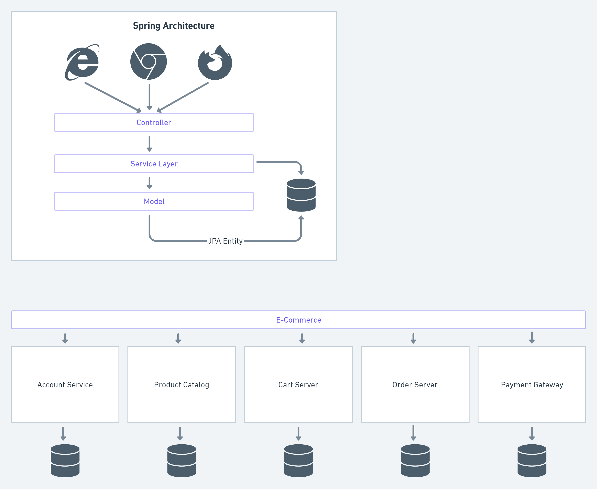

### Problem 1 - Centralized and Decentralized Database 

#### Buatlah rancangan dalam bentuk diagram yang menampilkan : 

• sebuah arsitektur aplikasi 
• memiliki minimum 5 services 
• terdapat services yang melakukan shared database 
• terdapat services yang melakukan database per service

Jawaban : 

Link : https://whimsical.com/architecture-XoQSWse4BWy8ngWLTLomGZ